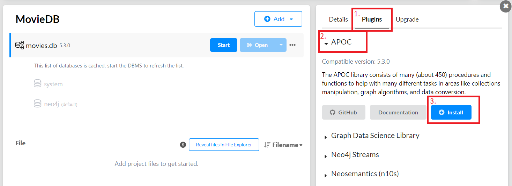

<div style="margin-bottom: 10px">
    
    <h1 style="margin-left: 100px;">Nautilus</h1>
</div>


If you use this code or parts of it, please cite the following paper:
   ```
   @inproceedings{DBLP:conf/models/HauslerK24, 
     author       = {Dominique Hausler and 
                     Meike Klettke},
     title        = {Nautilus: Implementation of an Evolution Approach for Graph Databases},
     booktitle    = {MoDELS (Companion)},
     pages        = {11--15},
     publisher    = {{ACM}},
     year         = {2024}
   }
   ```
The Nautilus Logo was created with ChatGPT from Sebastian Hausler and is licenced under CC BY-NC 4.0. All other images are also under the CC BY-NC 4.0 licence.
More information can be retrieved from the project webside: https://www.uni-regensburg.de/informatik-data-science/data-engineering/research/nautilus/index.html


### Neo4j Desktop Setup

**In order to use Nautilus you fist need to install Neo4j Desktop.**
1. Download the Neo4j Desktop application from https://neo4j.com/download-neo4j-now/ 
   - <p style="color: red">Important:</p> Keep the default settings of the user as well as the URI. This will enable you to use the pre filled out 
      data of Nautilus to easily connect to your database.
2. Create a project with a project name like `MovieDB` of your choice
3. Create a database within the project `MovieDB` created on step 2. with a
   - database name like `movies.db`
   - and a password you can easily remember: `myPassword123`
4. Make sure you install the APOC library directly in Neo4j Desktop under Plugins/APOC/install

   

5. As soon as you can see the version of the APOC library (here 5.3.0), the installation was sucessful.

   

6. Start your database by clicking the `Start` button. If your database was sucessfully started, it will look
like this:

   

   1. the name of the active database (here `movies.db`)
   2. the project file `MovieDB` you can find the database in
   3. the version of the APOC library (here 5.3.0)


### Add Data to the Neo4j Project
1. Use the `Open` button, illustrated in the picture above.
2. Copy the code from the `text_database.txt` file in this project.
3. Paste the data into the field in Neo4j Desktop (number 1.) as shown below and press the `run` button (number 2.).

   

4. If the data was successfully added, you will see the following. 3 shows that the data has been added, while 4. illustrates
all labels and types your database contains.

   


### Start the Django Project
1. Install Django:

       pip install django

2. Run the migrations:

       pip install -r requirements.txt

   If `pip install` is not working, you can also install the packages unter  `File/Settings/Project: ProjectName/Python Interpreter` by 
using the + button

3. Run the migrations:

       ./manage.py migrate

4. Run the development server:

       ./manage.py runserver

5. View the site at http://127.0.0.1:8000/nautilus/ 

#### Currently under construction
Disabled options are work in progress, e.g. copy relationship or copy properties

### Short Description of Nautilus
1. <p style="color: red"> Important: Always start the database you want to work with before using Nautilus! </p>

2. Connect to your Neo4j Desktop application:

   
   
   1. URI and User are already filled out with the default settings.
   2. Simply type in your password from `myPassword123`
   3. Use the `save connection` checkbox to remember your connection data.
   4. Use the `Get initial db statistics` button to see, what data is in your database. (Make sure to 
   use this button before operating evolution operations otherwise an error will occur.)
3. Execute evolution operations:

   
   
   1. Choose the operation you want to execute, e.g. add
   2. Select all necessary input from the drop-down menus.
   3. For multiple evoltuion operations use the `Add new form` button
   4. Press the `Submit` button to execute all queries top-down.
4. The generated output can be found at the bottom of the page:

   
   
   - The output consists of all evoltuion operations executed. These are displayed by GEO. 
   - All GEOs are sectioned to visualize the order in which they were executed as well as which of them were executed in
   one submit.
   - On the bottom you find the option to download a log file, containing all GEO.
   - When working with another/ a new database, you have the option of clearing the file by using the `Delete` button.
   
5. The database statistics are displayed as shown in this image:
   
   
   
   - You can switch between the statistics of either nodes or relationships.
   - Through the `Get initital db statistics` button all data currently available in your database is illustrates. 
   It is therefore, recommended, to use this button after filling in your connection data. 
   - On click, you find the schema of each entity type (= node/ relationship) including their quantity as aspect of 
   database statistics. 
   - The bar on the bottom allows showing more or less data. 


### Use Nautilus with your TestDatabase
1. Start the Django Project
2. Open: `http://127.0.0.1:8000/nautilus/`
3. Connect to your database (as shown in "Short Description of Nautilus" number 1.)
4. Press the `Get initial db statitstics` button, to display the data in your database (see "Short Description of Nautilus" number 5.)
5. Use the following evolution operations to manipulate your data. Then press the `submit` button.

   

7. At the top of the page the graphic will look like in the image below, showing the changes through the evolution operations.

   

8. At the bottom of the page, you find GEO in form of a history. This illustrates which operations were executed.

   

   

### What to do if you forgot your connection data?
In case you do not remember the URI and user of your Neo4j Desktop application, use the `Open` button (visualized in the
image of Section: `Neo4j Destop Setup` Steps 4 and 5) to start your database. Afterward a window will open
were you can finde the follwing information:


